# LG Aimers 9기 데이터 EDA 보고서

> 분석 대상: `train.csv`, 형식 확인용 `test.csv`, `sample_submission.csv`, `trackman_history.csv`  
> 분석 기준일: 2026-08-16 (제1부), 2026-08-17 (제2부 구조 분석)  
> 전체 집계 결과: [`results/eda_summary.json`](results/eda_summary.json), [`results/structural_summary.json`](results/structural_summary.json)  
> 현재 실행 환경: [`../LOCAL_ENVIRONMENT.md`](../LOCAL_ENVIRONMENT.md)  
> PowerShell 재실행: `& .\.venv\Scripts\python.exe eda\run_eda.py`, `& .\.venv\Scripts\python.exe eda\run_structural_eda.py`

이 문서는 두 부분으로 구성된다.

- **제1부(§1~§15)**: 컬럼 단위 분포·결측·그룹별 Target·정합성 등 표면 구조. 전수 스트리밍 집계.
- **제2부(§16~§23)**: 행 순서·`asof_*` 산술·Trackman 정확 연결 등 **데이터를 생성한 잠재 구조**. 제2부에서 제1부의 추정 두 가지(손 코드 매핑, Trackman 연결 불가)가 확정·번복됐다.

## 1. 핵심 결론

1. **가장 큰 위험은 시간에 따른 Target drift다.** 제구 성공률이 2019년 `56.47%`에서 2024년 `48.61%`로 `7.86%p` 하락했다. 전체 연도를 무작위로 섞은 검증은 2025년 평가 성능을 과대평가할 가능성이 높다.
2. **`game_type`과 시즌의 상호작용이 매우 크다.** `F` 유형은 2019~2022년 `58.78~70.87%`였지만 2023~2024년에는 `47.29%`, `45.93%`로 급변했다. 전체 기간의 단순 `game_type` 평균은 현재 체제를 잘못 설명한다.
3. **투수·타자 ID 효과가 강하다.** 표본 1,000개 이상 투수의 성공률 범위는 `40.02~71.80%`, 타자는 `44.59~68.36%`다. ID 기반 피처는 유망하지만 반드시 시간 순/OOF smoothing을 해야 한다.
4. **공식 `asof_*` 피처는 유효하지만 단일 피처의 선형 효과는 크지 않다.** 타깃과의 절대 Pearson 상관계수 최댓값은 `asof_pitcher_success_rate`의 `0.0843`이다. 비선형 상호작용과 확률 calibration이 중요하다.
5. **과거 성공률의 극단값은 그대로 예측 확률로 쓰면 과신된다.** 투수 과거 성공률이 평균 `0.989`인 구간의 현재 성공률은 `0.601`에 불과했다. 표본 수를 이용한 shrinkage가 필수다.
6. **결측은 적지만 그 자체로 정보가 있다.** 최근 경기 피처 6개가 `1.98%` 결측이며, 결측 행 성공률은 `55.08%`, 비결측 행은 `52.32%`다. 결측 indicator를 보존해야 한다.
7. **메인 학습 데이터의 정합성은 우수하다.** Target/카운트/주자/점수 정합성 위반과 입력 중복이 발견되지 않았다. 다만 여러 컬럼이 결정적으로 중복되므로 모델에 따라 정리할 가치가 있다.
8. **Trackman은 강력한 보조 데이터지만 단순 join은 불가능하다.** 공통 상황 키만으로는 후보가 중앙값 5개, 90백분위 15개다. 투수 ID 매핑과 시간 기준 집계가 별도로 필요하다.
9. **배포 `test.csv`는 5행뿐이다.** 5행 중 학습에서 본 투수는 2명, 타자는 3명이지만 이를 전체 평가 데이터의 비율로 일반화할 수 없다. 단, cold-start 처리가 반드시 필요하다는 형식 테스트로는 유용하다.

### 제2부에서 추가된 결론

10. **`asof_pitcher_n`은 투수별 통산 투구 카운터이고 2025로 이어진다.** 이 사실 하나에서 **시즌 내 누적 성공률**을 각 평가 행에서 복원할 수 있다. 이 단일 파생 피처는 2024에서 **492점**을 내며, 이는 현재 챔피언 앙상블 전체(409.7점)보다 높다. 제공된 통산 `asof_pitcher_success_rate`를 같은 방식으로 쓰면 **0점**이다. §21.
11. **Trackman은 확률적 매칭이 필요 없다. 정확히 연결된다.** 경기 단위 투구 상태 지문으로 train 경기의 55.5%가 Trackman과 1:1 매칭되고, 투구 단위 정렬이 **100.0%** 일치한다. 결과적으로 투수 731명·타자 780명·팀 13개가 결정적으로 복원되며 train 행의 **99.79%**를 커버한다. §19.
12. **`game_type`은 리그 등급이다.** R은 시즌당 정확히 720경기(KBO 1군 정규시즌), F는 2군(퓨처스) 경기다. 매칭된 F 경기의 구장은 전부 `LGMinor`, `SKFuturesPark` 같은 2군 구장이고, F 전용 팀 22·23은 각각 경찰야구단·상무다. §20.
13. **2023년 F 급변은 선수 구성이 아니라 라벨 생성 체제의 변화다.** F 2022·2023에 각각 50구 이상 던진 동일 투수 70명의 평균 성공률이 `0.7050 → 0.4836`으로 **-22.1%p** 변했고, 모든 2군 구장에서 동시에 발생했다. §20.
14. **시즌 간 하락도 대부분 선수 구성이 아니라 투수 내 변화다.** R 경기 5개 시즌 전이 전부에서 within-pitcher 성분이 composition 성분보다 크다(예: 2019→2020 `-2.18%p` vs `-0.08%p`). 전역 base-rate 항이 옳은 대응이고 선수 구성 모델링은 우선순위가 아니다. §22.
15. **타자는 신호가 거의 없다.** 2024 split-half 상한이 투수 `646점`인 데 비해 타자는 `38점`이다. 타자 시즌 내 누적 복원도 `0점`이다. §22.
16. **2025 평균 성공률을 맞히는 것이 모델링만큼 중요하다.** 1%p 오차가 `40점`, 2%p가 `160점`이다. 현재 모델들은 2024를 `1.07~1.51%p` 과대예측했다. §22.

## 2. 분석 방법과 범위

- 대용량 CSV를 메모리에 전부 올리지 않고 한 행씩 읽는 스트리밍 집계를 사용했다.
- 행 수, 결측, 범주 빈도, 그룹별 Target rate, 수치 모멘트, 타깃 상관, 정합성 검사는 전수 집계다.
- 수치 quantile과 `asof_*` 피처 간 상관은 결정론적 systematic sample을 사용한 근사치다.
  - `train.csv`: 매 50번째 행, 29,501행
  - `trackman_history.csv`: 매 75번째 행, 약 23,900행
- 입력 중복은 `row_id`와 Target을 제외한 피처를 64비트 해시로 비교했다. 충돌 확률은 매우 낮지만 법적·감사 수준의 완전 동일성 증명이 필요하면 원문 기반 재검증이 필요하다.
- Trackman에는 Target이 없으므로 물리량과 Target의 직접 관계는 분석하지 않았다.

## 3. 데이터 개요

| 데이터 | 행 | 열 | 파일 크기 | 기간/역할 |
| --- | ---: | ---: | ---: | --- |
| `train.csv` | 1,475,092 | 49 | 351.5 MiB | 2019~2024, 입력 48개 + Target |
| 배포 `test.csv` | 5 | 48 | 형식 샘플 | 2025, 실제 평가는 비공개 245,789행 |
| `sample_submission.csv` | 5 | 2 | 형식 샘플 | `row_id`, `control_success` |
| `trackman_history.csv` | 1,793,078 | 30 | 337.4 MiB | 2019-03-23~2024-10-17 |

학습 Target:

| `control_success` | 행 수 | 비율 |
| --- | ---: | ---: |
| 성공 `1` | 772,603 | 52.38% |
| 실패 `0` | 702,489 | 47.62% |

전체 학습 평균을 그대로 예측했을 때의 로컬 기준 Brier Score는 `r(1-r) = 0.249435`다. 이는 학습 데이터 탐색용 기준이며, 공식 평가의 기준값은 비공개 평가 데이터 평균 `r`로 다시 계산된다.

## 4. 시간 구조와 Target drift

`row_id`는 `TRAIN_0000001`부터 엄격히 순차적이며, 시즌은 파일 안에서 2019→2024 순서의 연속 블록으로 정렬되어 있다. 따라서 행 순서를 무작위로 나누면 미래 시즌이 학습 폴드에 섞인다.

| 시즌 | 행 수 | 성공률 | 전년 대비 |
| --- | ---: | ---: | ---: |
| 2019 | 237,413 | 56.47% | - |
| 2020 | 244,087 | 53.27% | -3.20%p |
| 2021 | 247,088 | 53.28% | +0.00%p |
| 2022 | 247,472 | 52.89% | -0.38%p |
| 2023 | 245,525 | 50.00% | -2.90%p |
| 2024 | 253,507 | 48.61% | -1.39%p |

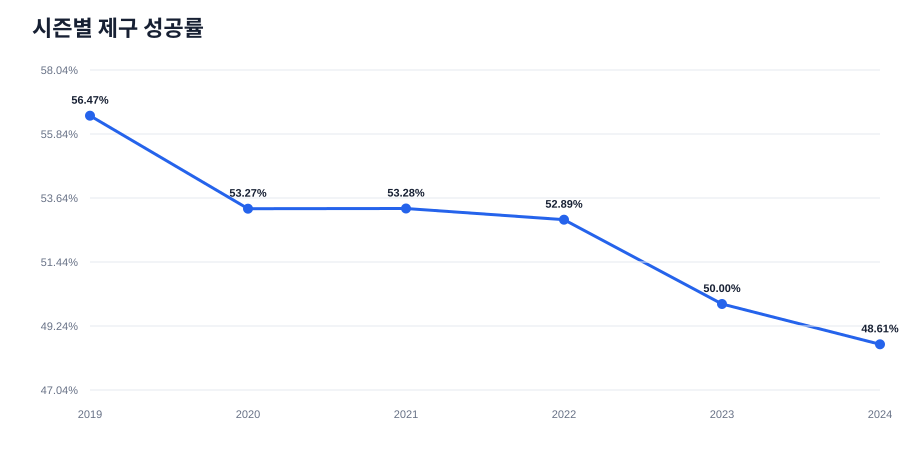

행 수는 시즌별 `23.7~25.4만`으로 비교적 안정적이다. 성공률 변화가 단순 표본 수 차이로 생긴 현상은 아니다.

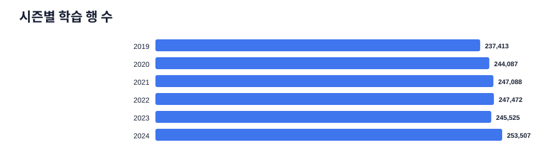

### 4.1 `game_type`과의 상호작용

전체 기간 평균은 `R=51.40%`, `F=60.33%`지만 이 평균은 위험하다.

| 시즌 | `R` 행 수 | `R` 성공률 | `F` 행 수 | `F` 성공률 |
| --- | ---: | ---: | ---: | ---: |
| 2019 | 211,627 | 54.95% | 25,786 | 68.92% |
| 2020 | 220,874 | 52.69% | 23,213 | 58.78% |
| 2021 | 221,227 | 51.28% | 25,861 | 70.38% |
| 2022 | 217,024 | 50.37% | 30,448 | 70.87% |
| 2023 | 219,839 | 50.31% | 25,686 | 47.29% |
| 2024 | 223,497 | 48.97% | 30,010 | 45.93% |

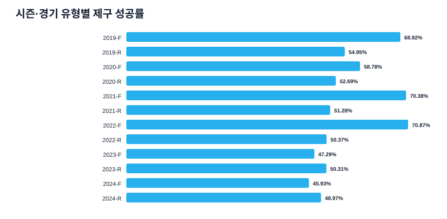

`F`에서 2022→2023 사이에 약 `23.6%p`의 체제 변화가 보인다. 원인이 경기 집단 변화, 라벨 생성 방식 변화, 선수 구성 변화 중 무엇인지는 제공 데이터만으로 단정할 수 없다. 모델링에서는 다음을 모두 비교해야 한다.

- `season × game_type` 상호작용
- 최근 시즌 가중치 적용
- 2022년 이전/이후 별도 모델 또는 calibration
- 2024 홀드아웃에서 `R`, `F` Brier Score 개별 기록

### 4.2 월·이닝 효과

- 월별 성공률은 3월 `53.75%`에서 10월 `50.92%`까지 낮아진다.
- 1~3회 `53.10%`, 4~6회 `52.49%`, 7~9회 `51.56%`, 연장 `50.49%`로 이닝이 진행될수록 하락한다.
- 그러나 시즌, 선수 피로, 선수 구성과 얽힌 관측값이므로 인과 효과로 해석하면 안 된다.

## 5. 경기 상황별 Target

### 5.1 볼-스트라이크 카운트

가장 높은 구간은 `0-1`의 `53.41%`, 가장 낮은 구간은 풀카운트 `3-2`의 `49.96%`다.

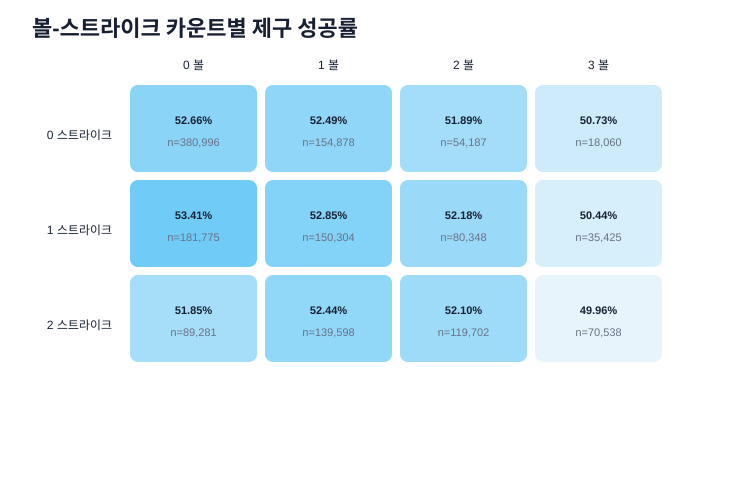

| 카운트 | 행 수 | 성공률 |
| --- | ---: | ---: |
| 0-0 | 380,996 | 52.66% |
| 0-1 | 181,775 | 53.41% |
| 0-2 | 89,281 | 51.85% |
| 1-0 | 154,878 | 52.49% |
| 1-1 | 150,304 | 52.85% |
| 1-2 | 139,598 | 52.44% |
| 2-0 | 54,187 | 51.89% |
| 2-1 | 80,348 | 52.18% |
| 2-2 | 119,702 | 52.10% |
| 3-0 | 18,060 | 50.73% |
| 3-1 | 35,425 | 50.44% |
| 3-2 | 70,538 | 49.96% |

3볼 이후 성공률이 일관되게 낮다. `balls_before`, `strikes_before`를 독립 숫자로만 쓰기보다 12개 카운트 조합을 범주형 또는 interaction으로 제공하는 편이 자연스럽다.

### 5.2 주자·점수·중요도

- 주자 상태의 가중 표준편차는 `0.27%p`로 작다.
- 성공률 최저는 만루 `51.61%`, 최고는 3루만 있는 상태 `53.61%`다.
- 투수 팀이 5점 이상 뒤지는 경우 `50.75%`, 동점은 `53.01%`다.
- Leverage Index는 `<0.5`에서 `51.68%`, `1~2`에서 `52.91%`이며 단조 관계는 아니다.

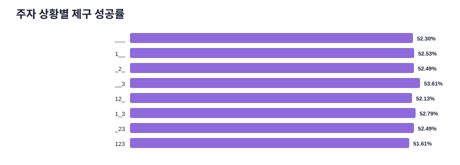

### 5.3 좌우 조합

코드 자체의 공식 의미는 데이터 설명서에 명시되지 않았지만, Trackman과 공통 상황 키를 비교하면 **`1=Left`, `2=Right`가 가장 일관적인 매핑**으로 추정된다.

> **§19에서 확정됨.** 투구 단위 정확 정렬 결과 `1=Left`, `2=Right`가 투수 `99.96%`, 타자 `99.89%` 일치로 증명됐다. 아래의 "추정" 표현은 제1부 작성 시점 기준이다.

| 조합 | 행 수 | 성공률 |
| --- | ---: | ---: |
| P1-B1 | 170,292 | 49.09% |
| P1-B2 | 211,059 | 53.75% |
| P2-B1 | 525,455 | 53.07% |
| P2-B2 | 568,286 | 52.21% |

P1 투수에서 타자 손 방향에 따른 차이가 `4.66%p`로 크다. `pitcher_hand × batter_hand` interaction은 명시적으로 넣을 가치가 있다. 손 코드 매핑은 공식 답변을 받기 전까지 추정값으로만 관리한다.

## 6. 선수·팀 ID와 표본 수

### 6.1 ID cardinality와 집중도

| 단위 | 고유 ID | 빈도 중앙값 | 최대 빈도 | 상위 10개 행 비중 |
| --- | ---: | ---: | ---: | ---: |
| 투수 | 792 | 856.5 | 15,450 | 9.03% |
| 타자 | 830 | 473.0 | 13,928 | 8.88% |

표본 1,000개 이상인 개체만 보더라도:

- 투수 성공률: `40.02~71.80%` (`374명`)
- 타자가 상대했던 투구의 성공률: `44.59~68.36%` (`300명`)

선수 간 차이는 경기 상황 피처보다 훨씬 크다. 다만 다음 위험이 있다.

- 선수 ID가 시즌 및 `game_type`과 강하게 결합되어 있을 수 있다.
- 전체 데이터로 만든 Target encoding은 미래 Target을 사용하는 누수다.
- 평가 데이터에 신규 ID가 포함될 수 있다.

권장 방식은 시간 순 out-of-fold 또는 행별 cutoff를 적용한 smoothed encoding이다. 원래 제공된 `asof_*`를 기본값으로 쓰고, raw ID는 regularized tree/embedding에서 비교한다.

### 6.2 경험량과 cold start

| 누적 표본 | 투수 기준 성공률 | 타자 기준 성공률 |
| --- | ---: | ---: |
| 0 | 55.18% | 60.24% |
| 1~9 | 54.47% | 57.14% |
| 10~49 | 54.85% | 57.47% |
| 50~199 | 53.77% | 56.20% |
| 200~999 | 53.05% | 54.36% |
| 1000+ | 51.90% | 51.28% |

이 감소를 경험이 쌓이면 제구가 나빠진다는 인과 효과로 보면 안 된다. 누적 표본 수가 큰 행은 대체로 후반 시즌에 있고, Target 자체가 시간에 따라 하락하기 때문이다. `log1p(n)`, 시즌, 선수 prior의 상호작용을 검증해야 한다.

## 7. 결측치

### 7.1 학습 데이터

결측은 `asof_*`에만 존재한다.

| 컬럼군 | 결측 행 | 결측률 | 결측 행 성공률 | 비결측 행 성공률 |
| --- | ---: | ---: | ---: | ---: |
| 최근 1/3/5경기 성공률·middle rate 6개 | 29,185 | 1.98% | 55.08% | 52.32% |
| 투수 누적 rate·구종 비율 8개 | 792 | 0.05% | 55.18% | 52.38% |
| 타자 누적 rate 2개 | 830 | 0.06% | 60.24% | 52.37% |

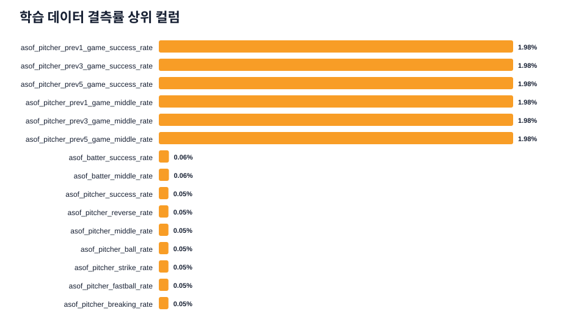

- 투수 누적 rate 결측 792행은 `asof_pitcher_n=0`의 792행과 일치한다.
- 타자 누적 rate 결측 830행은 `asof_batter_n=0`의 830행과 일치한다.
- 결측은 MCAR가 아니다. 단순 평균 대치만 하지 말고 결측 indicator와 표본 수를 함께 둔다.

### 7.2 형식 확인용 test 5행

- 최근 경기 피처: 3/5행 결측
- 투수 누적 rate: 1/5행 결측
- 타자 누적 rate: 2/5행 결측
- 학습에 등장한 ID: 투수 2/5, 타자 3/5

5행짜리 샘플은 일부러 edge case를 포함했을 가능성이 있어 실제 비율을 추정할 수 없다. 추론 코드가 신규 ID, `n=0`, 결측 rate를 안전하게 처리하는지만 확인한다.

## 8. `asof_*` 피처의 정보량과 calibration

### 8.1 타깃과의 단변량 상관

| 순위 | 피처 | Pearson r |
| ---: | --- | ---: |
| 1 | `asof_pitcher_success_rate` | +0.0843 |
| 2 | `asof_pitcher_prev5_game_success_rate` | +0.0816 |
| 3 | `asof_pitcher_reverse_rate` | -0.0795 |
| 4 | `asof_pitcher_prev3_game_success_rate` | +0.0778 |
| 5 | `asof_pitcher_prev1_game_success_rate` | +0.0617 |
| 6 | `asof_batter_success_rate` | +0.0589 |
| 7 | `season` | -0.0483 |
| 8 | `asof_batter_n` | -0.0363 |

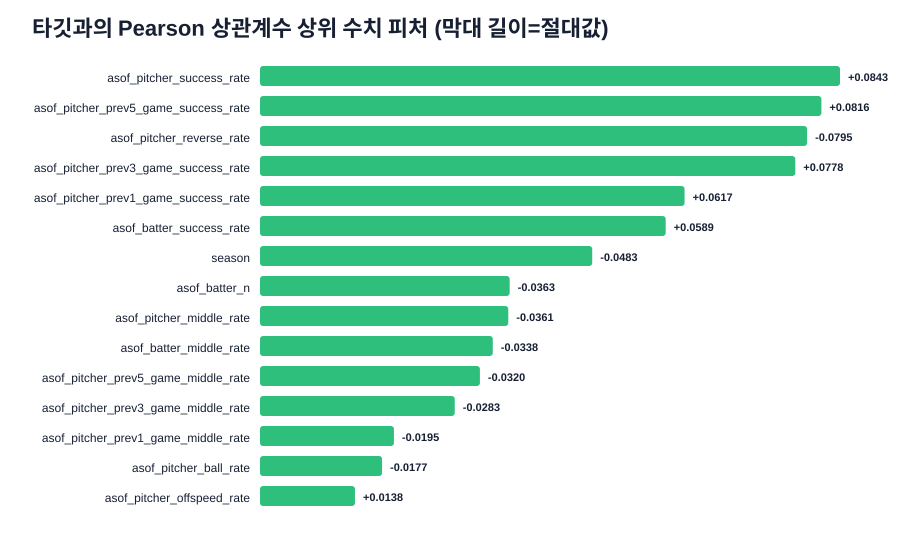

상관이 낮다고 피처가 쓸모없다는 뜻은 아니다. Target이 확률적이고 선수·시즌·상황 상호작용이 크므로 비선형 모델에서 추가 정보가 생길 수 있다.

### 8.2 과거 성공률의 shrinkage 필요성

| 투수 과거 성공률 구간 | 행 수 | 피처 평균 | 현재 성공률 |
| --- | ---: | ---: | ---: |
| 0.0~0.1 | 786 | 0.004 | 46.82% |
| 0.1~0.2 | 348 | 0.154 | 40.23% |
| 0.2~0.3 | 1,609 | 0.254 | 45.87% |
| 0.3~0.4 | 13,226 | 0.368 | 44.30% |
| 0.4~0.5 | 359,899 | 0.471 | 47.42% |
| 0.5~0.6 | 931,212 | 0.544 | 52.91% |
| 0.6~0.7 | 150,849 | 0.632 | 60.22% |
| 0.7~0.8 | 13,491 | 0.729 | 66.77% |
| 0.8~0.9 | 1,661 | 0.828 | 65.14% |
| 0.9~1.0 | 1,219 | 0.989 | 60.13% |

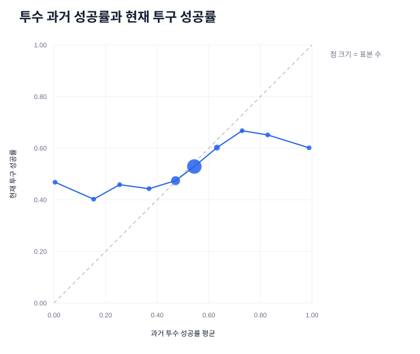

양 극단은 대부분 표본이 적으며 실제 현재 성공률은 전체 평균 쪽으로 크게 수축한다. 권장 후보:

- `n` 기반 Beta-Binomial/empirical Bayes smoothing
- rate와 `log1p(n)` interaction
- raw rate 대신 logit 변환 후 clipping
- 최근 1/3/5경기와 누적 prior의 가중 조합
- 2024 OOF 예측에 대한 isotonic 또는 Platt calibration

### 8.3 다중공선성

systematic sample에서 절대 상관이 큰 쌍:

| 피처 1 | 피처 2 | 상관 |
| --- | --- | ---: |
| 최근 3경기 성공률 | 최근 5경기 성공률 | +0.882 |
| 최근 3경기 middle rate | 최근 5경기 middle rate | +0.843 |
| 투수 누적 성공률 | 투수 reverse rate | -0.811 |
| 투수 ball rate | 투수 strike rate | -0.775 |
| 누적 성공률 | 최근 5경기 성공률 | +0.696 |

선형/로지스틱 모델에서는 regularization이 필수다. 트리 모델에서도 유사 피처가 importance를 나눠 갖기 때문에 permutation importance나 ablation으로 판단한다.

## 9. 결정적 중복과 데이터 정합성

전수 검사에서 다음 관계가 모든 행에서 성립했다.

- `num_runners_on = runner_on_1b + runner_on_2b + runner_on_3b`
- `base_state`는 세 runner flag로 완전히 결정됨
- `run_total_before = run_top_before + run_bot_before`
- `score_diff_home`은 두 점수로 결정됨
- `score_diff_pitcher_team`은 `top_bottom`과 `score_diff_home`으로 결정됨
- `asof_pitcher_pitchmix_n = asof_pitcher_n`
- 구종 비율이 존재하면 fastball + breaking + offspeed = 1
- 홈·원정 기대 승률 합은 반올림 오차 `±0.1` 이내에서 100

홈·원정 기대 승률 합이 정확히 100이 아닌 행은 58,607개(`3.97%`)지만 차이는 모두 `±0.1`이며 한 자리 소수 반올림 결과다.

모델별 처리 제안:

- 트리 모델: 중복 피처를 유지한 버전과 제거한 버전을 비교하되 중요도 해석 시 주의
- 선형 모델: 한 관계에서 기준 피처 하나를 제거하여 수치 안정성 확보
- `row_id`: 식별·제출용으로만 사용하고 모델 입력에서는 제거

64비트 피처 해시 기준으로 `row_id`와 Target을 제외한 완전 중복 행은 0개였다. Target binary 위반, 잘못된 runner 상태, 점수 계산 불일치, 비정상 메인 카운트도 0개였다.

## 10. Trackman EDA

### 10.1 범위와 cardinality

| 항목 | 값 |
| --- | ---: |
| 기간 | 2019-03-23~2024-10-17 |
| 경기 | 5,980 |
| 투수 Trackman ID | 906 |
| 타자 Trackman ID | 913 |
| 투수/타자 팀 코드 | 각각 26 |
| 수동 구종명 | 17 |
| 자동 구종명 | 11 |
| 정규화 구종군 | 4 |

### 10.2 구종군

| 구종군 | 행 수 | 비중 |
| --- | ---: | ---: |
| fastball | 931,120 | 51.93% |
| breaking | 512,851 | 28.60% |
| offspeed | 326,809 | 18.23% |
| other | 22,298 | 1.24% |

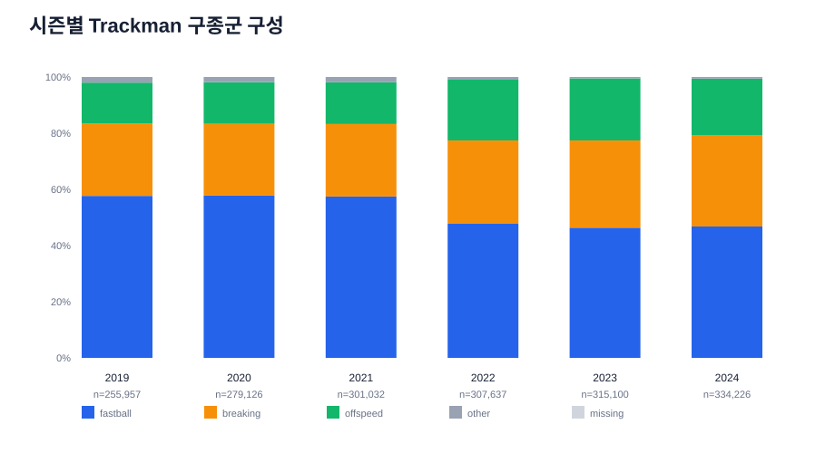

2019→2024 변화:

- fastball: `57.68% → 46.78%`
- breaking: `25.83% → 32.48%`
- offspeed: `14.48% → 20.18%`
- other: `2.00% → 0.57%`

실제 구종 선택 변화와 태깅/분류 체계 변화가 함께 섞일 수 있다. `tagged_pitch_type`에는 `ChangeUp`/`Changeup`, `SInker`, `Undefined#`, `Undefind` 같은 표기 변형이 있고, 수동·자동 구종명이 정확히 같은 비율은 `55.07%`다. 모델 피처의 기본 단위는 정규화된 `pitch_type_group`이 안전하다.

### 10.3 물리량

전체 분포:

| 물리량 | 평균 | 중앙값 | 1~99백분위 | 결측률 |
| --- | ---: | ---: | ---: | ---: |
| `rel_speed` | 135.96 | 137.50 | 111.05~152.43 | 0.42% |
| `zone_speed` | 124.59 | 126.01 | 101.95~139.31 | 0.44% |
| `spin_rate` | 2,169.97 | 2,225.83 | 1,005.50~2,865.03 | 0.70% |
| `induced_vert_break` | 25.78 | 30.21 | -42.75~62.02 | 0.56% |
| `horz_break` | 9.45 | 12.81 | -45.42~55.12 | 0.58% |
| `extension` | 1.759 | 1.760 | 1.362~2.149 | 0.43% |

구종군별 릴리스 구속 중앙값:

- fastball `142.96`
- offspeed `130.67`
- breaking `128.53`
- other `122.52`

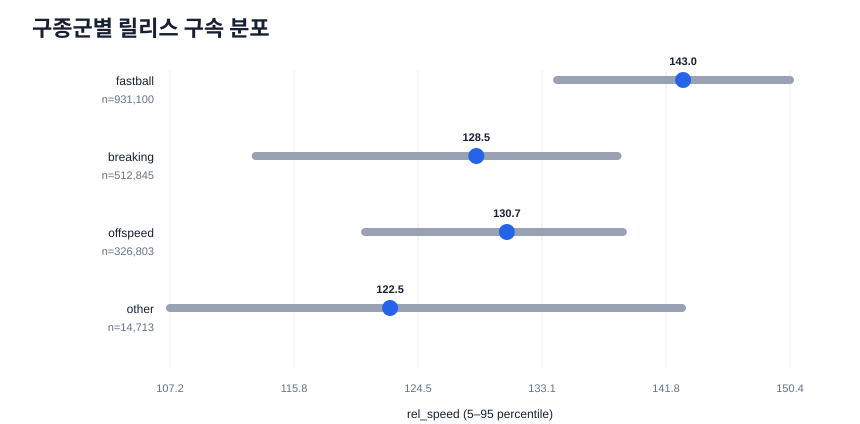

`other` 구종군은 주요 물리량 결측률이 `34~45%`로 다른 구종군보다 압도적으로 높다. `other`를 일반 구종과 동일하게 대치하기보다 별도 indicator/그룹으로 취급한다.

### 10.4 Trackman 결측과 이상치

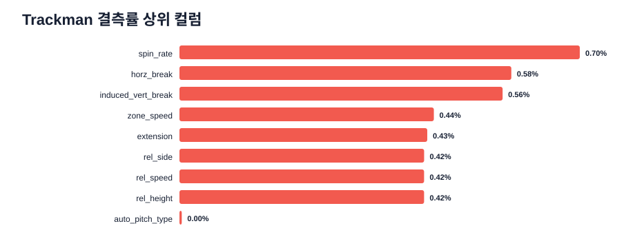

| 항목 | 건수 | 처리 권장 |
| --- | ---: | --- |
| `spin_rate` 결측 | 12,465 | 구종군·투수 기준 대치 + indicator 후보 |
| `horz_break` 결측 | 10,333 | 동일 |
| `induced_vert_break` 결측 | 10,062 | 동일 |
| `zone_speed` 결측 | 7,921 | 동일 |
| `outs_before`가 3 또는 4 | 95 | 비정상 카운트 flag 후 제외/결측 처리 비교 |
| `balls_before=4` | 1 | 원본 확인 후 제외 후보 |
| `strikes_before=3` | 1 | 원본 확인 후 제외 후보 |
| 음수 `extension` | 3 | 물리적으로 비정상, 결측 처리 권장 |
| `(trackman_game_id, pitch_no)` 중복 | 2 | 두 행 비교 후 중복 제거 기준 수립 |

이상치를 단순 clipping하기 전에 행을 별도 파일로 추출하고 실제 태그/다른 측정값을 확인하는 것이 안전하다. 예시 ID는 `eda_summary.json`의 `trackman.invariant_examples`에 저장했다.

## 11. 메인 데이터와 Trackman 연계 가능성

> **§19에서 대체됨.** 이 절은 "공통 상황 컬럼만" 사용했을 때의 결론이며, 그 조건에서는 실제로 다대다가 맞다. 그러나 **행 순서로 경기를 복원한 뒤 경기 단위로 매칭**하면 연결은 결정적으로 풀린다. 아래 5개 권고 중 "신뢰도 점수를 둔다", "대응이 확실한 투수만 사용한다"는 더 이상 필요하지 않다. 시점 cutoff 관련 권고(3·4·5번)는 그대로 유효하다.

공통으로 존재하는 다음 10개 컬럼을 사용해 후보 수를 계산했다.

```text
season, game_month, game_dayofweek, inning, top_bottom,
balls_before, strikes_before, outs_before, pitcher_hand, batter_hand
```

손 코드 매핑 결과:

| 추정 매핑 | 후보가 1개 이상인 train 행 | 후보가 정확히 1개인 행 | 후보 수 중앙값 | 90백분위 |
| --- | ---: | ---: | ---: | ---: |
| `1=Left`, `2=Right` | 98.33% | 8.93% | 5 | 15 |
| `1=Right`, `2=Left` | 77.45% | 18.43% | 2 | 8 |

첫 번째 매핑이 공통 상황 분포와 훨씬 잘 맞으며, 메인 데이터의 code 2 비율과 Trackman의 Right 비율도 유사하다. 따라서 `1=Left`, `2=Right`로 추정할 근거는 강하지만 공식 정의는 아니다.

공통 상황만으로는 대부분 다대다이므로 직접 merge하면 잘못된 현재 투구 Trackman 값이 섞일 수 있다. 안전한 방향:

1. 투수 ID 대응을 별도 global matching으로 추정하고 신뢰도 점수를 둔다.
2. 대응이 확실한 투수만 Trackman 요약 피처를 사용한다.
3. 학습 행에서는 반드시 해당 행 시즌/시점보다 과거 로그만 집계한다.
4. 2025 평가 행에는 2019~2024 집계만 사용한다.
5. 현재 투구의 개별 Trackman 측정값을 붙이지 않고 투수·구종군 수준의 과거 요약만 사용한다.

## 12. 검증 설계 권장안

### 12.1 주 검증

| Fold | Train | Validation | 목적 |
| --- | --- | --- | --- |
| A | 2019~2021 | 2022 | 초기 rolling 성능 |
| B | 2019~2022 | 2023 | `F` 체제 변화 대응 |
| C | 2019~2023 | 2024 | **최종 모델 선택의 주 기준** |

모든 fold에서 전체 Brier Score와 함께 다음 세그먼트를 별도 기록한다.

- `game_type`: R/F
- 투수/타자 cold start 및 표본 수 구간
- 좌우 조합 4개
- 카운트 12개
- 시즌에 처음 등장한 선수 vs 기존 선수

무작위 K-fold 점수는 디버깅 참고용으로만 사용한다. 최종 의사결정은 Fold C와 rolling 평균을 우선한다.

### 12.2 피처 생성 원칙

- 모든 Target encoding과 선수/팀 통계는 validation 시점 이전 데이터로만 계산한다.
- test 전체를 이용한 빈도·분포·신규 선수 판단은 대회 규칙 위반이므로 금지한다.
- 한 행의 예측이 배치 크기, test 행 순서, 다른 test 행 존재 여부에 따라 달라지지 않아야 한다.
- Trackman 집계에는 `cutoff_season` 또는 날짜 cutoff를 명시적으로 받는 함수를 사용한다.

## 13. 우선순위 실험 제안

| 우선순위 | 실험 | 검증할 가설 |
| ---: | --- | --- |
| 1 | 최근 시즌 가중치 또는 2022~2024 전용 학습 | 오래된 라벨 체제를 줄이면 2024 Brier가 개선되는가 |
| 2 | `season × game_type` interaction/분리 calibration | 2023 이후 F 체제 변화를 모델이 흡수하는가 |
| 3 | `asof_*` + CatBoost/LightGBM 계열 정형 baseline | 범주·결측·비선형 interaction이 선형 baseline보다 유리한가 |
| 4 | `n` 기반 empirical Bayes smoothing | 과거 성공률 극단값의 과신을 줄이는가 |
| 5 | 시간 순 OOF 선수/팀 encoding | raw ID보다 cold-start와 드리프트에 강한가 |
| 6 | 카운트·좌우·경기유형 명시 interaction | 관측된 큰 그룹 차이가 Brier 개선으로 이어지는가 |
| 7 | Trackman 투수 ID 매핑 + 과거 물리량 요약 | 신뢰도 높은 투수에서만 추가 정보가 생기는가 |
| 8 | 2024 OOF 확률 calibration | ranking은 유지하면서 Brier를 개선하는가 |
| 9 | 중복 결정 피처 제거 ablation | 속도·안정성을 높이면서 성능을 유지하는가 |

첫 baseline부터 반드시 다음을 실험 로그에 함께 남긴다.

- Fold별 Brier Score와 대회 환산 점수
- R/F 세그먼트 Brier
- cold-start Brier
- 학습/추론 시간, peak RAM, 모델 파일 크기
- 사용 피처와 cutoff 정책

## 14. 제1부 분석 한계

- 실제 평가 데이터는 비공개이며 배포 test 5행으로 분포 이동을 추정할 수 없다.
- 상관과 그룹별 성공률은 인과 효과가 아니다. 시즌·선수·경기 유형이 강하게 교란한다.
- quantile과 `asof_*` 상호 상관은 systematic sample 근사치다. 행 수·결측·그룹률·타깃 상관은 전수 집계다.
- ~~Trackman과 메인 데이터의 ID 대응을 실제로 복원한 분석은 아직 포함하지 않았다.~~ → §19에서 해결.
- ~~`game_type` 코드의 실제 의미와 손 코드의 공식 의미는 별도 공식 확인이 필요하다.~~ → §19·§20에서 데이터로 확정. 다만 운영진의 공식 정의 문서는 여전히 없다.

## 15. 제1부 산출물

```text
eda/
├── EDA_REPORT.md
├── run_eda.py
├── results/
│   └── eda_summary.json
└── figures/
    ├── train_rows_by_season.svg
    ├── target_rate_by_season.svg
    ├── target_rate_by_season_game_type.svg
    ├── target_rate_by_count.svg
    ├── target_rate_by_base_state.svg
    ├── train_missingness.svg
    ├── numeric_target_correlations.svg
    ├── pitcher_prior_calibration.svg
    ├── trackman_pitch_mix_by_season.svg
    ├── trackman_missingness.svg
    └── trackman_speed_by_group.svg
```

`run_eda.py`는 외부 Python 패키지 없이 실행 가능하며 원본 CSV를 수정하지 않는다.

---

# 제2부: 데이터를 생성한 구조

## 16. 제2부의 질문과 방법

제1부는 "컬럼이 어떻게 생겼는가"를 봤다. 제2부는 **"이 행들을 무엇이 만들었는가"**를 본다. 익명화된 메인 테이블이 여전히 흘리고 있는 잠재 구조를 네 단계로 복원한다.

```text
행 순서       ──> 경기 경계, 시간 순 정렬, 개체별 카운터        (§17)
asof_* 산술   ──> 정수 이벤트 카운트, 숨은 실패 범주            (§18)
경기          ──> trackman_history.csv와의 정확 1:1 매칭       (§19)
그 매칭       ──> 투수·타자·팀·손 코드의 결정적 복원           (§19, §20)
                  시즌 내 누적 복원과 2025 drift 접근 경로      (§21)
```

방법은 `eda/run_structural_eda.py` 하나에 모두 들어 있다. 제1부와 달리 numpy/pandas를 사용한다(`requirements-baseline.txt`에 이미 고정된 버전). 현재 Windows PC에서 로컬 전체 실행은 **21.8초**였다.

```powershell
$env:PYTHONUTF8 = '1'
& .\.venv\Scripts\python.exe eda\run_structural_eda.py
```

원본 CSV는 읽기만 하며, 결과는 `results/structural_summary.json`에 저장된다.

## 17. 행 순서: train은 완전한 시간 순이다

### 17.1 카운터 검증

`asof_pitcher_n`이 파일 순서 기준 **투수별 누적 등장 횟수와 전 행에서 정확히 일치**한다. 타자도 같다.

| 검증 | 결과 |
| --- | ---: |
| `asof_pitcher_n == groupby(pitcher_id).cumcount()` | 1,475,092 / 1,475,092 행 일치 |
| `asof_batter_n == groupby(batter_id).cumcount()` | 1,475,092 / 1,475,092 행 일치 |

이는 두 가지를 동시에 뜻한다.

1. **파일의 행 순서는 2019~2024 전체에 걸친 실제 시간 순서다.** 제1부가 "시즌이 연속 블록"이라고 관측한 것보다 훨씬 강한 성질이다.
2. **`asof_pitcher_n`은 시즌마다 초기화되지 않는 통산 카운터다.** 이 성질이 §21의 근거가 된다.

### 17.2 경기 복원

다음 규칙으로 경기 경계를 잡으면 train이 **4,868경기**로 분할된다.

```text
새 경기 = (season, game_month, game_dayofweek, {두 팀}) 키가 바뀜
        | inning*2 + (top_bottom=='B') 가 감소
        | run_total_before 가 감소
```

| 검증 항목 | 값 | 해석 |
| --- | ---: | --- |
| `game_type=R` 경기 수 | 시즌당 **720 또는 721** | KBO 1군 정규시즌(144경기×10팀÷2)과 정확히 일치 |
| 경기당 투구 수 중앙값 | 300 (1~99백분위 223~411) | 실제 야구 경기 분포 |
| 최종 이닝 | 9회 4,462경기, 10~13회 349경기 | 정규 이닝 + 연장 |
| 경기당 등판 투수 수 | 평균 9.42명 | 실제 KBO 운영과 일치 |
| 2020년 3·4월 경기 수 | **0** | 코로나로 5월 5일 개막한 실제 2020 시즌 |
| 2021년 7월 경기 수 | 42 (평년 90~110) | 도쿄 올림픽 휴식기 |

경기 수·투구 수·달력 공백이 모두 실제 KBO 일정과 맞으므로 이 복원은 우연이 아니다.

### 17.3 파생되는 사실과 한계

**얻는 것**

- 홈/원정을 정확히 유도할 수 있다. `top_bottom=='T'`이면 투수 팀이 홈이다. `score_diff_pitcher_team == score_diff_home` (초) / `== -score_diff_home` (말)이 **전 행에서 성립**한다.
- 학습 데이터 안에서 경기 단위·타석 단위 집계를 만들 수 있다.

**주의: 홈/원정은 신호가 없다**

| 투수 팀 | 행 수 | 성공률 |
| --- | ---: | ---: |
| 원정 (말 수비) | 722,280 | 52.44% |
| 홈 (초 수비) | 752,812 | 52.31% |

차이가 `0.13%p`에 불과하다. 유도는 가능하지만 피처로서의 가치는 사실상 없다.

**결정적 한계: 이 구조는 test에 전이되지 않는다**

배포 test 5행의 `row_id` 순서별 `game_month`는 `[7, 3, 6, 3, 3]`이다. **`TEST_000001`이 7월, `TEST_000017`이 3월**이므로 test의 `row_id`는 시간 순이 아니다. 따라서

- test에서 경기를 복원할 수 없다.
- "경기 내 몇 번째 투구인가", "직전 투구는 무엇이었나" 같은 피처는 **평가 시점에 만들 수 없다**.
- `row_id`의 숫자 부분을 시간 인덱스로 쓰려는 시도는 근거가 없다.

경기 복원은 **학습 자산을 만드는 도구**이지 평가 피처가 아니다. §21이 이 벽을 우회하는 유일한 경로다.

## 18. `asof_*`의 산술 구조와 숨은 실패 범주

### 18.1 정수 카운트는 정확히 복원된다

rate 컬럼은 6자리 유효숫자로 반올림돼 있지만, `round(rate × n)`으로 원래 정수 카운트를 되찾을 수 있다.

| 검증 | 결과 |
| --- | ---: |
| 같은 투수의 연속 행에서 `Δ(성공 카운트) == control_success` | **1.0000** (1,474,300 / 1,474,300) |
| `round(rate × n)`의 최대 절대 오차 | `7.6e-3` |

n이 15,450(train 최대)일 때도 반올림 오차는 0.008 수준이므로 정수 복원은 안전하다.

### 18.2 실패는 3분류이고 그중 하나는 제공되지 않았다

`failure = 1 - asof_pitcher_success_rate`로 두면:

| 관계 | 성립 비율 |
| --- | ---: |
| `reverse_rate ≤ failure` | 1.0000 |
| `middle_rate ≤ failure` | 1.0000 |
| `reverse + middle == failure` | 0.0042 |
| `reverse + middle > failure` | 0.0019 |

즉 `reverse`와 `middle`은 실패의 **부분집합**이고 거의 항상 둘의 합이 실패보다 작다. 남는 잔차가 대회 설명의 세 번째 실패 유형인 **"스트라이크존에서 크게 벗어난 공"**이다.

```text
asof_pitcher_wide_rate = 1 - success_rate - reverse_rate - middle_rate
```

| 항목 | 값 |
| --- | ---: |
| 복원된 wide rate 평균 | `0.1077` |
| 전체 실패 중 비중 | `23.17%` |
| 세 범주가 겹치는 행 | `0.19%` |

또한 `ball_rate + strike_rate ≤ 1`이 전 행에서 성립하고 잔차 평균은 `0.1859`다. 이 잔차는 볼도 스트라이크도 아닌 결과(인플레이 타구 등)로 보이며, 성공/실패 축과는 **독립된 두 번째 축**이다.

### 18.3 그러나 wide rate는 예측에 쓸모가 없다

구조적으로 흥미롭다고 해서 피처로 유용한 것은 아니다. 2024에서 각 파생 rate를 단독 피처로 썼을 때:

| 복원한 시즌 내 rate | Target과의 상관 | 단일 피처 환산 점수 |
| --- | ---: | ---: |
| success | — | **492** |
| reverse | `-0.0650` | 225 |
| middle | `-0.0226` | 0 |
| **wide (새로 복원)** | `+0.0052` | **0** |

`wide`는 상관이 사실상 0이다. §18.2는 **라벨 정의를 이해하는 데** 쓰고, 피처로는 `success`(와 보조적으로 `reverse`)만 남긴다. 이 절은 "복원 가능한 것"과 "쓸모 있는 것"이 다르다는 사례로 남긴다.

## 19. Trackman 정확 연결: 확률적 매칭이 필요 없다

제1부 §11은 공통 상황 컬럼만으로는 후보가 중앙값 5개라 결론 내렸다. 맞는 관측이지만 **잘못된 매칭 단위**를 썼다. 투구 하나가 아니라 **경기 하나**를 매칭하면 문제가 바뀐다.

### 19.1 경기 지문 매칭

각 경기에 대해 그 경기에 포함된 모든 투구의 `(inning, 초/말, balls, strikes, outs)` 상태를 **순서 무관 multiset**으로 만들고 해시한다. 상태 공간이 1,152개뿐이라 한 경기(약 300투구)의 상태 분포는 사실상 고유한 지문이 된다.

| 항목 | 값 |
| --- | ---: |
| train 경기 | 4,868 |
| Trackman 경기 | 5,980 |
| 지문 일치 쌍 | 2,702 |
| **모호성 없는 1:1 매칭** | **2,700 (train 경기의 55.5%)** |
| 매칭 경기의 투구 수 일치 | 100% |
| season/month/dayofweek 일관성 | 99.7% |

### 19.2 투구 단위 정렬은 완벽하다

매칭된 경기를 train은 행 순서, Trackman은 `pitch_no` 순서로 정렬한 뒤 원소별로 비교하면:

| 항목 | 값 |
| --- | ---: |
| 정렬된 행 수 | **810,644** |
| 원소별 `(inning, 초말, B, S, O)` 일치율 | **1.000000** |
| 100% 일치 경기 | 2,700 / 2,700 |

즉 810,644개 train 행 각각에 대해 **정확히 대응하는 Trackman 행**을 알 수 있다.

### 19.3 복원되는 것

| 대상 | 복원 수 | 순도(최빈 후보 비중) | 단사(1:1) |
| --- | ---: | ---: | :---: |
| `pitcher_id → pitcher_trackman_id` | **731 / 792** | 평균 0.9984, 중앙값 1.0 | ✅ 731→731 |
| `batter_id → batter_trackman_id` | **780 / 830** | 평균 0.9936, 중앙값 1.0 | 780→779 |
| `pitcher_team_id → 실제 KBO 팀` | **13 / 13** | 평균 0.9198 | ✅ |

**손 코드가 확정됐다.**

| `pitcher_hand` | Left | Right |
| ---: | ---: | ---: |
| 1 | 205,582 | 66 |
| 2 | 220 | 604,776 |

`1 = Left`, `2 = Right`. 투수 99.96%, 타자 99.89% 일치다. 제1부의 추정이 옳았음이 증명됐다.

**팀 ID가 실명으로 복원됐다.**

| ID | 팀 | ID | 팀 | ID | 팀 |
| ---: | --- | ---: | --- | ---: | --- |
| 12 | DOO_BEA 두산 | 16 | KIA_TIG KIA | 20 | KT_WIZ KT |
| 13 | LG_TWI LG | 17 | HAN_EAG 한화 | 21 | SSG_LAN SSG |
| 14 | KIW_HER 키움 | 18 | SAM_LIO 삼성 | 22 | KBO_POL 경찰 (F 전용) |
| 15 | LOT_GIA 롯데 | 19 | NC_DIN NC | 23 | KBO_ARM 상무 (F 전용) |
| | | | | 25 | MIN_HAW (F 전용) |

팀 순도가 0.92로 낮은 이유는 **SK 와이번스 → SSG 랜더스(2021) 개명** 때문이다. 익명 ID 21이 시즌에 따라 `SK_WYV`와 `SSG_LAN` 양쪽에 대응한다. 팀 매핑은 시즌을 함께 다뤄야 한다.

### 19.4 커버리지: 55%가 아니라 99.79%다

매칭된 경기는 55.5%지만, **선수 매핑은 전역**이다. 한 번이라도 매칭된 경기에 나온 투수는 모든 경기에서 매핑된다.

| 대상 | train 행 커버리지 |
| --- | ---: |
| 매핑된 투수를 가진 행 | **99.79%** |
| 매핑된 타자를 가진 행 | 99.95% |
| 둘 다 | 99.74% |
| 시즌별 투수 커버리지 | 2019 99.55% ~ 2020 99.88% |
| `game_type` 별 | R 99.98%, F 98.29% |

매핑되지 않은 투수는 61명이고 이들의 투구 수 중앙값은 36구, 합계는 전체의 `0.21%`다.

### 19.5 실험 로드맵에 주는 함의

기존 로드맵의 `E02`(매핑 품질 감사), `A30`(확률적 linkage), `A31`(hard vs soft aggregate)은 **전제가 무너졌다**. match posterior, entropy, top1-top2 margin, unmatched flag, multiple-imputation 앙상블은 만들 필요가 없다. 남는 것은 훨씬 단순하다.

1. 결정적 매핑 사전 하나를 학습 자산으로 동결한다.
2. 매핑 안 되는 0.21% 투수에 대한 fallback만 정의한다.
3. **cutoff 규칙에 집중한다.** 연결이 정확해질수록 미래 정보 누출 위험은 오히려 커진다.

특히 매칭된 2,700경기는 `trackman_game_id`에서 **실제 경기 날짜**(`20190329-Gocheok-1`)를 얻을 수 있으므로, 시즌 단위가 아니라 **날짜 단위 point-in-time cutoff**로 Trackman 집계를 만들 수 있다.

### 19.6 무엇을 하면 안 되는가

정렬이 완벽하다는 것은 **현재 투구의 실제 구종·구속·무브먼트를 알 수 있다**는 뜻이다. 이는 규정상 명시적 금지 항목이다.

- 매칭된 train 행에 현재 투구의 Trackman 값을 붙여 학습하면, 평가 시점에 존재하지 않는 정보에 의존하는 모델이 된다. 2025 Trackman은 제공되지도 않는다.
- **허용되는 사용법**은 이 정렬을 **라벨 생성기**로 쓰는 것이다. 즉 810,644행에 실제 `pitch_type_group`을 붙여 "투구 직전 정보 → 구종군 확률" 분류기를 학습하고, 평가 시점에는 그 **확률로 주변화**한다. 이것이 기존 로드맵 `E22`의 정확한 구현 경로이며, 지금까지는 지도 라벨이 없어 불가능했다.

구종군 효과는 작지 않다.

| `pitch_type_group` | 행 수 | 성공률 |
| --- | ---: | ---: |
| fastball | 424,755 | **54.37%** |
| offspeed | 146,291 | 51.43% |
| other | 8,562 | 49.61% |
| breaking | 231,036 | **48.50%** |

fastball과 breaking의 차이 `5.87%p`는 카운트·주자·점수차 등 어떤 상황 피처보다 크다.

### 19.7 Trackman 물리량: 부호가 반대인 두 신호

정렬된 R 경기 행(300구 이상 투수 400명, 720,740행)에서 상관을 **투수 간(between)**과 **투구 내(within)**로 분해했다.

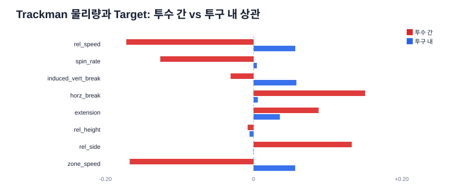

| 물리량 | 단순 상관 | **투수 간** | **투구 내** |
| --- | ---: | ---: | ---: |
| `rel_speed` | +0.0445 | **-0.1719** | +0.0563 |
| `zone_speed` | +0.0439 | **-0.1672** | +0.0562 |
| `spin_rate` | -0.0014 | **-0.1259** | +0.0045 |
| `horz_break` | +0.0115 | **+0.1507** | +0.0058 |
| `rel_side` | +0.0140 | **+0.1332** | -0.0004 |
| `extension` | +0.0316 | +0.0879 | +0.0355 |
| `induced_vert_break` | +0.0543 | -0.0310 | +0.0578 |
| `rel_height` | -0.0021 | -0.0080 | -0.0054 |

**구속에서 Simpson's paradox가 나타난다.** 단순 상관은 `+0.045`지만, 투수 간으로는 `-0.172`(빠른 투수일수록 제구 성공률이 낮다), 투구 내로는 `+0.056`(같은 투수 안에서는 빠른 공이 더 성공)이다. 단순 상관만 보고 피처를 만들면 **부호를 반대로 배우게 된다**.

평가 시점에 쓸 수 있는 것은 **투수 간 성분뿐**이다(과거 집계). 그리고 그 성분이 제공된 어떤 `asof_*` 단변량 상관(최대 0.0843)보다 크다. 다만 이 값은 투수 400명 단위의 집계 상관이므로 행 단위 예측력으로 직접 환산하면 안 된다.

투수 수준 요약값과 성공률의 상관:

| 투수 수준 요약 | r |
| --- | ---: |
| 평균 구속 | -0.171 |
| 평균 회전수 | -0.127 |
| 평균 수평 무브먼트 | +0.151 |
| 평균 릴리스 좌우 | +0.133 |
| 평균 extension | +0.088 |
| **구속 표준편차** | **-0.095** |
| **릴리스 좌우 표준편차** | **-0.082** |
| fastball 사용 비율 | -0.079 |

구속·릴리스 좌우의 **산포가 클수록 성공률이 낮다**. 이는 §5.2에서 인용한 Kirby Index·release repeatability 계열 연구의 핵심 가설이 이 데이터에서도 성립함을 뜻한다(단, 릴리스 높이 산포는 부호가 반대이며 구종 혼합에 오염돼 있으므로 구종군 내부에서 다시 계산해야 한다).

## 20. `game_type`의 정체와 2023 F 체제 변화

### 20.1 F는 2군(퓨처스) 경기다

세 가지 증거가 일치한다.

**증거 1 — 경기 수.** R은 시즌당 정확히 720/721경기로 KBO 1군 정규시즌과 일치한다. F는 시즌당 76~104경기다.

**증거 2 — 전용 팀.** 13개 팀 ID 중 22·23·25는 **F 경기에만** 등장하고, §19에서 각각 `KBO_POL`(경찰야구단), `KBO_ARM`(상무), `MIN_HAW`로 복원됐다. 경찰·상무는 퓨처스리그 전용 구단이다.

**증거 3 — 구장.** 매칭된 경기의 구장을 보면 완전히 갈린다.

| `game_type` | 구장 |
| --- | --- |
| R (2,462경기) | Jamsil 588, Suwon 278, Gocheok 275, NCDinosMajors 272, Daejeon 270, DaeguPark 263, Incheon 259, Sajik 257 |
| F (240경기) | **LGMinor 154**, HanwhaMinors 21, DoosanMinors 18, SKFuturesPark 11, Masan 9, HeroesMinors 6, SamsungMinor 5, IksanStadium 5 |

F 경기는 전부 2군 구장이다. 또한 팀 13(LG)이 F 투구의 49%를 차지하고 매칭된 F 경기의 64%가 `LGMinor`이므로, **F는 LG 2군을 중심으로 수집된 퓨처스 경기 표본**이다.

### 20.2 2023년 급변은 라벨 체제 변화다

제1부는 F가 2022년 70.87%에서 2023년 47.29%로 `23.6%p` 떨어진 것을 관측하고 원인을 특정할 수 없다고 했다. 세 가지 검사로 원인을 좁힐 수 있다.

**검사 1 — 같은 투수만 본다.** F 2022와 F 2023에 각각 50구 이상 던진 투수 70명:

| | 2022 | 2023 | 변화 |
| --- | ---: | ---: | ---: |
| 동일 투수 70명 평균 성공률 | 0.7050 | 0.4836 | **-22.14%p** |

F 2023 투구의 55.1%가 이 투수들에게서 나온다. **선수 구성 변화로 설명되지 않는다.**

**검사 2 — 구장별로 본다.** 급락이 특정 구장에 몰려 있으면 장비/추적 문제일 수 있다.

| 구장 | 2022 | 2023 |
| --- | ---: | ---: |
| DoosanMinors | 0.687 | 0.468 |
| SKFuturesPark | 0.720 | 0.442 |
| SamsungMinor | 0.697 | 0.437 |

**모든 2군 구장에서 동시에** 발생했다.

**검사 3 — R과 비교한다.** 같은 기간 R의 시즌 간 within-pitcher 변화는 `-0.4 ~ -2.2%p` 수준이다.

결론: 실력 변화나 표본 변화가 아니라 **퓨처스 등급 전체에 걸친 Target 생성 규칙의 변화**다. 실제 투수의 제구 능력이 1년 만에 22%p 나빠지는 일은 없다.

### 20.3 모델링 함의

1. **2022년 이전 F 데이터는 다른 척도 위에 있다.** 2025 예측에 유효한 F 관측치는 2023·2024뿐이며, 이는 F 전체 16.1만 구 중 **5.6만 구**에 불과하다. F 전용 모델은 표본이 얇다.
2. **F를 선형 외삽하면 안 된다.** 최근 3시즌(0.7087, 0.4729, 0.4593) 선형 외삽은 2025년 `0.2975`라는 무의미한 값을 낸다. 단절 이후 수준(2023·2024 평균 `0.4661`)에서 출발해야 한다.
3. `season × game_type` 상호작용은 필수지만, F 쪽 파라미터는 **2023 이후만** 보게 제약해야 한다.
4. test 2025에 F가 얼마나 들어 있는지는 알 수 없다. 배포 5행은 전부 R이다. train 비중(약 10.9%)이 유지된다고 가정하되, F 예측이 크게 틀려도 전체 점수에 미치는 영향은 그 비중만큼이다.

## 21. 시즌 내 누적 복원: 2025 drift에 접근하는 합법적 경로

이 저장소의 모든 실험이 부딪힌 벽은 하나다. **2025 라벨이 없으므로 2025 체제를 배울 수 없다.** §17.1의 카운터 성질이 이 벽에 구멍을 낸다.

### 21.1 복원 원리

`asof_pitcher_n`은 시즌마다 초기화되지 않는 통산 카운터다. 따라서 학습 데이터에서 각 투수의 **2024 종료 시점 상태**를 고정 상수로 뽑아 두면, 2025 평가 행 하나만 보고 그 투수의 2025 시즌 성적을 뺄셈으로 복원할 수 있다.

```text
동결 자산 (train만 사용):
    n_end[p]    = 투수 p의 마지막 train 행 asof_pitcher_n + 1
    s_end[p]    = round(마지막 행 rate × n) + 마지막 행 control_success

평가 행 하나에서:
    n_2025 = asof_pitcher_n            - n_end[pitcher_id]
    s_2025 = round(rate × asof_pitcher_n) - s_end[pitcher_id]
    rate_2025 = (s_2025 + k·prior) / (n_2025 + k)
```

배포 test 5행에 적용한 결과:

| 행 | 투수 | test의 `n` | 2024 종료 `n` | **2025 투구 수** | **2025 성공률** | 통산 성공률 |
| --- | ---: | ---: | ---: | ---: | ---: | ---: |
| TEST_000001 | 21813 | 3,465 | 3,085 | 380 | **0.3579** | 0.4895 |
| TEST_000213 | 24198 | 486 | 87 | 399 | **0.4461** | 0.4753 |
| TEST_000017 | 24745 | 86 | 학습에 없음 | 86 (=통산) | — | — |
| TEST_005332 | 24713 | 0 | 학습에 없음 | 0 | — | — |
| TEST_035185 | 24713 | 9 | 학습에 없음 | 9 (=통산) | — | — |

신인 투수는 `n_end = 0`이 정답이므로 **통산 = 시즌 내**가 되어 식이 그대로 성립한다. 즉 커버리지 문제는 "학습에 있는 투수"가 아니라 "`n > 0`인 투수"다.

### 21.2 규정 적합성

이 피처는 대회의 행 독립성 원칙을 **어기지 않는다**.

| 규칙 | 이 피처 |
| --- | --- |
| 그 행의 입력 | `asof_pitcher_n`, `asof_pitcher_success_rate`, `pitcher_id` ✅ |
| 그 행에서 만든 파생변수 | 뺄셈과 shrinkage ✅ |
| 학습 데이터에서 학습한 고정 통계 | `n_end[p]`, `s_end[p]` 사전 ✅ |
| 다른 test 행 사용 | **없음** ✅ |
| 배치 크기·순서 의존 | **없음** — 한 행만 넣어도 같은 값 ✅ |

금지 목록의 "test 내부 누적/rolling/집계"와는 성질이 다르다. 누적을 **우리가 계산하는 것이 아니라**, 운영진이 이미 각 행 안에 넣어 준 누적값에서 학습 시점의 상수를 빼는 것뿐이다.

**불변성 테스트 실측.** 피처를 행 하나만 받는 순수 함수로 구현해 배포 test 5행에 대해 대회가 요구하는 세 검사를 돌린 결과:

| 검사 | 최대 절대 차이 |
| --- | ---: |
| 한 행 단독 vs 배치 | `0.00e+00` |
| 원래 순서 vs 셔플 | `0.00e+00` |
| 중복 행 삽입 후 동일 행 | `0.00e+00` |

부동소수점 허용 오차가 아니라 **정확히 0**이다. 구현이 다른 행을 참조할 여지 자체가 없기 때문이다.

다만 반드시 지켜야 할 것: **test 행들의 `rate_2025`를 모아 평균을 내는 것은 금지다.** 그것은 test 전체 분포를 쓰는 것이고 명시적 위반이다. 값은 행 안에 머물러야 한다. 구현 시 **test 데이터프레임 전체를 인자로 받는 코드 경로를 아예 만들지 않는 것**이 이 경계를 지키는 가장 확실한 방법이다.

### 21.3 검증: 2024를 2025처럼 다뤘을 때

2019~2023을 학습 구간으로 두고 동결 자산을 만든 뒤, 2024를 평가 시즌으로 삼아 각 피처를 **단독 예측값**으로 사용했다.

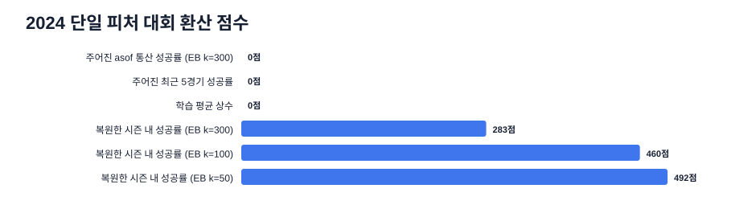

| 단일 피처 | Brier | 환산 점수 |
| --- | ---: | ---: |
| 학습 평균 상수 | 0.251875 | 0 |
| 제공 `asof_pitcher_success_rate` (EB k=100) | 0.249930 | **0** |
| 제공 `asof_pitcher_success_rate` (EB k=300) | 0.250019 | **0** |
| 제공 `asof_pitcher_prev5_game_success_rate` | 0.250806 | **0** |
| 복원 시즌 내 성공률 (EB k=300) | 0.249100 | 283 |
| 복원 시즌 내 성공률 (EB k=100) | 0.248657 | 460 |
| **복원 시즌 내 성공률 (EB k=50)** | **0.248577** | **492** |
| 복원 시즌 내 성공률 + 정확한 평균 보정 | 0.248420 | 544 |

**참고**: 현재 챔피언인 `Linear 90% + HGB 10%` 전체 파이프라인의 2024 점수는 **409.7**이다. 파생 피처 하나가 그것을 넘는다.

커버리지도 문제없다.

| 항목 | 2024 |
| --- | ---: |
| 시즌 내 `n > 0` 행 | **99.85%** |
| 시즌 내 `n ≥ 200` 행 | 75.80% |
| 시즌 내 `n` 중앙값 | 506 |
| 직전 시즌들에 등장한 투수 | 80.14% |

### 21.4 왜 통산 rate는 0점인데 시즌 내 rate는 492점인가

두 값의 **평균 수준**이 다르다.

| 예측 | 2024 예측 평균 | 실제 2024 |
| --- | ---: | ---: |
| 통산 rate (EB k=300) | 51.78% | 48.61% |
| 시즌 내 rate (EB k=50) | 49.75% | 48.61% |

통산 rate는 2019~2023의 높은 체제를 평균에 계속 끌고 다니므로 `3.17%p` 과대예측한다. 시즌 내 rate는 정의상 **현재 시즌 체제 안에서만** 계산되므로 `1.14%p`까지 좁혀진다.

이것이 핵심 메커니즘이다. **모델은 2025 라벨을 보지 않고도, 각 투수의 2025 자기 성적을 통해 2025 체제를 간접적으로 관측한다.** 제1부 §1이 "가장 큰 위험"으로 지목한 Target drift에 대한 가장 직접적인 대응이다.

통산 rate에 resolution이 없는 것은 아니다. 평균을 정답으로 강제 보정하면 317점이 나온다. 즉 통산 rate의 문제는 **calibration**이고, 시즌 내 rate는 그 calibration을 구조적으로 해결한다.

### 21.5 확장되지 않는 방향

같은 복원을 다른 대상에 적용하면 값이 없다.

| 복원 대상 | 2024 단일 피처 점수 |
| --- | ---: |
| 투수 시즌 내 성공률 | **492** |
| 투수 시즌 내 reverse rate | 225 |
| 투수 시즌 내 middle rate | 0 |
| 투수 시즌 내 wide rate | 0 |
| **타자 시즌 내 성공률** | **0** |
| 타자 통산 성공률 | 0 |

타자 쪽은 완전히 비어 있다. §22의 상한 분석과 일치한다.

## 22. 성능 상한과 base rate 민감도

### 22.1 드리프트는 선수 구성이 아니라 투수 내 변화다

R 경기만 대상으로, 인접 두 시즌에 각각 200구 이상 던진 투수의 변화를 within 성분으로, 나머지를 composition 성분으로 나눴다.

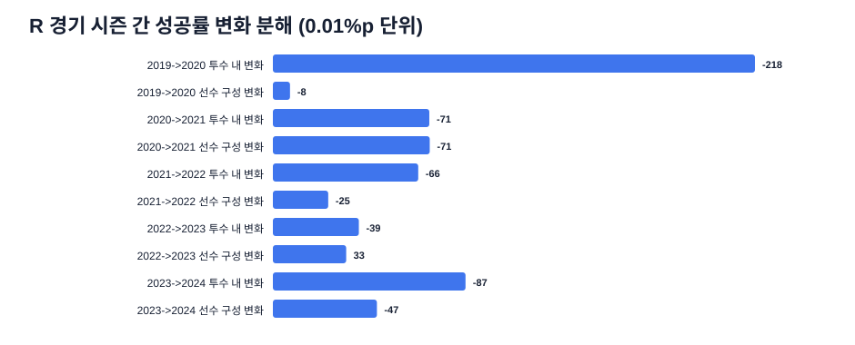

| 전이 | 전체 변화 | **투수 내** | 선수 구성 |
| --- | ---: | ---: | ---: |
| 2019→2020 | -2.257%p | **-2.179%p** | -0.077%p |
| 2020→2021 | -1.416%p | -0.707%p | -0.709%p |
| 2021→2022 | -0.907%p | **-0.657%p** | -0.250%p |
| 2022→2023 | -0.057%p | -0.389%p | +0.331%p |
| 2023→2024 | -1.341%p | **-0.871%p** | -0.470%p |

다섯 전이 전부에서 투수 내 성분이 지배적이거나 최소한 동등하다. **모든 투수에게 동시에 일어나는 전역 변화**이므로, 대응은 선수 수준 모델링이 아니라 **전역 base-rate 항**이다.

### 22.2 정직한 성능 상한

2024 안에서 무작위로 절반을 나눠, 한쪽에서 그룹 평균을 추정하고 다른 쪽에서 채점했다(in-sample 과적합 없음).

| 그룹 | EB k=0 | EB k=50 | EB k=200 |
| --- | ---: | ---: | ---: |
| **투수** | 535 | 638 | **646** |
| **투수 × 타자 손** | 535 | **800** | 766 |
| 투수 × 카운트 | 0 | 273 | 339 |
| 투수 × 타자 (raw pair) | 0 | 287 | 130 |
| **타자** | 0 | 0 | **38** |

읽는 법:

- **투수 정체성이 낼 수 있는 시즌 내 신호의 총량이 약 646점**이다. `투수 × 타자 손`까지 넣으면 800점이다. 이것이 "완벽한 선수 정보"의 상한이다.
- **타자는 38점이다.** 사실상 없다. 타자 ID·타자 이력에 모델링 예산을 쓸 이유가 없다.
- **raw pitcher-batter pair는 해롭다.** 수축을 강하게 해도 287점으로 투수 단독보다 나쁘다. 로드맵이 이를 금지한 것은 옳았다.
- **투수 × 카운트도 투수 단독보다 나쁘다.** 카운트는 투수와 곱해서 쓸 대상이 아니다.

시즌을 건너뛰면 신호가 절반으로 준다.

| 2023 투수 성공률 → 2024 예측 | 환산 점수 |
| --- | ---: |
| EB k=0 | 56 |
| EB k=200 | 249 |
| EB k=500 | 252 |
| EB k=500 + 정확한 평균 보정 | **337** |

즉 **시즌 내 신호 646점 중 시즌을 넘어 전이되는 것은 250~340점**뿐이다. 현재 모델들이 2024에서 350~586점을 내는 것은 이 전이 상한을 넘는 값이고, 그 초과분이 바로 `asof_*`가 제공하는 **시즌 내** 정보에서 온다. §21이 그 경로를 명시적으로 강화하는 방법이다.

### 22.3 2025 base rate를 맞히는 것의 가치

평균만 틀려도 잃는 점수는 다음과 같다(2024 기준 `r(1-r) = 0.249807`).

| 평균 오차 | 잃는 점수 |
| ---: | ---: |
| 0.2%p | 2 |
| 0.5%p | 10 |
| **1.0%p** | **40** |
| 1.5%p | 90 |
| **2.0%p** | **160** |
| 3.0%p | 360 |

기본 베이스라인 보고서 §5.2에 따르면 현재 모델들은 2024를 `1.07~1.51%p` 과대예측했다. **즉 지금도 45~90점을 평균 오차로만 잃고 있다.**

외삽 후보값:

| 방법 | 2025 예측 평균 |
| --- | ---: |
| 전체 6시즌 선형 | 0.4747 |
| 최근 3시즌 선형 | 0.4622 |
| R만 최근 3시즌 선형 | 0.4849 |
| F만 최근 3시즌 선형 | 0.2975 (**단절 때문에 무효**) |
| 2024 실측 | 0.4861 |

R과 F를 따로 외삽하고 비중으로 다시 합치되, F는 §20.3대로 단절 이후 수준만 쓴다. 후보 범위가 `0.462~0.486`으로 **2.4%p** 벌어져 있고, 이는 최대 230점에 해당한다. 이 폭을 좁히는 것이 단일 모델 교체보다 기대 이득이 크다.

중요한 것은 §21의 시즌 내 피처가 **이 문제를 부분적으로 자동 해결한다**는 점이다. 2025 투수들의 시즌 내 성적이 낮으면 예측도 자동으로 내려간다. 명시적 외삽과 시즌 내 피처는 **경쟁 관계가 아니라 보완 관계**이며, 둘을 함께 쓸 때 이중 보정이 되지 않는지 반드시 검사해야 한다.

## 23. 제2부 분석 한계

- **매칭 55.5%의 원인을 규명하지 않았다.** 매칭된 경기는 투구 수가 100% 일치하므로, 나머지는 Trackman에 없거나 일부 투구가 누락된 경기로 보인다. 부분 매칭(근사 지문)은 시도하지 않았다. 선수 매핑 커버리지가 이미 99.79%라 실익이 작다고 판단했다.
- **F의 정체는 데이터 기반 추론이다.** 구장·전용 팀·경기 수가 모두 퓨처스리그를 가리키지만 운영진의 공식 확인은 없다. `MIN_HAW`(팀 25)가 어느 구단인지도 특정하지 못했다.
- **2023 F 체제 변화의 원인은 여전히 모른다.** "선수 구성이 아니고 특정 구장도 아니다"까지만 밝혔다. 라벨 생성 규칙·추적 시스템·기록 주체 중 무엇이 바뀌었는지는 제공 데이터로 알 수 없다.
- **§21의 검증은 2024 한 시즌 단일 피처 실험이다.** 모델에 넣었을 때의 증분 이득, 2022·2023 fold에서의 재현, F 세그먼트에서의 거동은 아직 측정하지 않았다. 실험 명세는 로드맵 `E14`로 옮겼다.
- **§19.7의 투수 간 상관은 투수 400명 단위 집계 상관**이며 행 단위 예측력이 아니다. 실제 이득은 ablation으로만 확인할 수 있다.
- **2025 test의 구성은 여전히 미지다.** F 비중, 신규 선수 비율, `asof_pitcher_n` 분포 모두 train에서 추정한 값이다.

## 24. 제2부 산출물

```text
eda/
├── run_structural_eda.py            # 23초, numpy/pandas 사용
├── results/
│   └── structural_summary.json      # 아래 모든 수치의 원본
└── figures/
    ├── season_to_date_vs_given.svg
    ├── trackman_between_within.svg
    └── drift_within_vs_composition.svg
```

`structural_summary.json`의 최상위 키는 `structure`(§17), `labels`(§18), `linkage`(§19·§20), `drift`(§22.1·§22.3), `ceilings`(§22.2), `season_to_date`(§21), `test_sample`(§17.3·§21.1)이다. `linkage.pitcher_id_recovery.map`과 `linkage.team_id_recovery.map`에는 복원된 전체 매핑 사전이 들어 있다.
